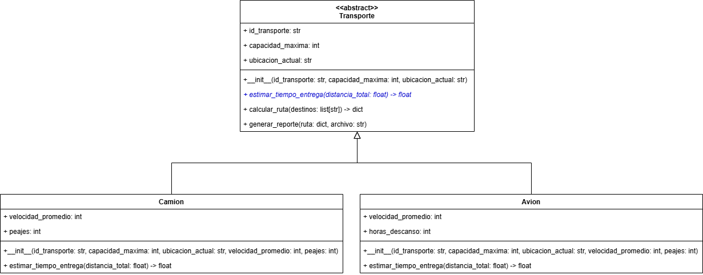

# Gestión de Redes Logísticas

Una empresa de logística necesita desarrollar un sistema que gestione su red de 
transporte para optimizar el envío de paquetes entre varias ciudades. Cada medio 
de transporte tiene características específicas, y el sistema debe calcular rutas 
básicas, tiempos estimados de entrega y manejar problemas comunes en las redes 
logísticas.

Se te ha asignado la tarea de implementar el módulo de la lógica de negocio del
sistema, con base en el siguiente diseño:



Para la implementación de este módulo, debes tener en cuenta las siguientes
instrucciones:

## Clase `Transporte`

* Debe ser una clase abstracta.
* Tiene los atributos `id_transporte` de tipo `str`, `capacidad_maxima` de tipo
  `int` y `ubicacion_actual` de tipo `str`. Los tres atributos son inicializados
  con parámetros en el constructor.
* Define un método abstracto (el que está en color azul en el diagrama) 
  `estimar_tiempo_entrega` que recibe un parámetro `distancia_total` de tipo `float` y
  retorna un valor de tipo `float`.
* Define un método `calcular_ruta` que recibe un parámetro `destinos` de tipo
  `list[str]` y retorna un valor de tipo `dict`. Este método debe calcular la ruta para los destinos
  desde la ubicación actual del transporte. El método debe verificar que existan conexiones válidas
  en el diccionario de distancias, en caso de que no haya rutas válidas, el método debe generar
  una excepción de tipo `DestinoInalcanzableError`.
  
  > **Pistas** 
  > - La excepción `DestinoInalcanzableError` está definida en el módulo `errores`, el cual debes importar.
  >   Revisa bien la definición de la clase de excepción para saber cómo debes lanzarla, ya que esta recibe
  >   como parámetro el destino que no se puede alcanzar.
  > - Debes importar el diccionario de distancias definido en el módulo `datos` para verificar las rutas válidas.

  **Ejemplo:**
  Supongamos que la `ubicacion_actual` del transporte es `"Bogotá"` y que el listado de `destinos` es 
  `["Cali", "Cartagena", "Medellín"]`. <br/>
  <br/>
  Si el diccionario de distancias tiene la siguiente estructura:
  ```python
  distancias = {
    ("Bogotá", "Cali"): 460,
    ("Bogotá", "Medellín"): 415,
    ("Bogotá", "Cartagena"): 1035,
    ("Cali", "Medellín"): 415,
    ("Cali", "Cartagena"): 1010,
    ("Medellín", "Cartagena"): 630
  }
  ```
  
  El método `calcular_ruta` debería retornar un diccionario con la siguiente estructura:
  ```python
  {
    "ruta": ["Bogotá", "Cali", "Cartagena", "Medellín"],
    "distancia_total": 2100
  }
  
* Define un método `generar_reporte` que recibe como parámetros `ruta` de tipo `dict` (un diccionario
  con el formato que devuelve el método `calcular_ruta`) y `archivo` de tipo `str`. Este método debe
  generar un archivo de texto con el nombre especificado en el parámetro `archivo` que contenga la
  información de la ruta. El archivo debe tener el siguiente formato:
  ```plaintext
  Reporte de Transporte
  ----------------------
  ID del Transporte: {id_transporte}
  Capacidad Máxima: {capacidad_maxima} kg
  Ubicación Actual: {ubicacion_actual}
  Ruta Calculada: {ruta}
  Distancia Total: {distancia_total} km
  ```
  Donde `{id_transporte}`, `{capacidad_maxima}`, `{ubicacion_actual}`, `{ruta}` y `{distancia_total}`
  deben ser reemplazados por los valores correspondientes.

  <br/>
  
  **Ejemplo:** Si tenemos un `Camion` con los siguientes datos:
  ```python
  camion = Camion(
      id_transporte="CAM-001",
      capacidad_maxima=5000,
      ubicacion_actual="Bogotá",
      velocidad_promedio=60,
      peajes=5
  )
  ```
  
  Y la siguiente ruta calculada:
  ```python
  ruta = {
    "ruta": ["Bogotá", "Cali", "Cartagena"], 
    "distancia_total": 1470
  }
  ```
  El método `generar_reporte` debería generar un archivo con el siguiente contenido:
  ```plaintext
  Reporte de Transporte
  ----------------------
  ID del Transporte: CAM-001
  Capacidad Máxima: 5000 kg
  Ubicación Actual: Bogotá
  Ruta Calculada: Bogotá -> Cali -> Cartagena
  Distancia Total: 1470 km
  ```  

## Clase `Camion`

* Debe heredar de la clase `Transporte`.
* Tiene los atributos `velocidad_promedio` de tipo `int` y `peajes` de tipo `int`.
  Ambos atributos son inicializados con parámetros en el constructor (además de los atributos heredados).
* Implementa el método `estimar_tiempo_entrega` que calcula el tiempo estimado de entrega
  de un paquete en función de la distancia total (kilómetros) y la velocidad promedio del camión (kilometros por hora). 
  El tiempo estimado de entrega se calcula con la fórmula:
  ```plaintext
  tiempo_estimado = distancia_total / velocidad_promedio
  ```
  Al tiempo estimado se le deben sumar el tiempo (**en horas**) que se retrasa el camión por cada peaje. Se
  estima que cada peaje retrasa al camión 10 minutos.
  
  > **Pista:** Para convertir minutos a horas, puedes dividir los minutos entre 60.

## Clase `Avion`

* Debe heredar de la clase `Transporte`.
* Tiene los atributos `velocidad_promedio` de tipo `int` y `horas_descanso` de tipo `int`.
  Ambos atributos son inicializados con parámetros en el constructor (además de los atributos heredados).
* Implementa el método `estimar_tiempo_entrega` que calcula el tiempo estimado de entrega
  de un paquete en función de la distancia total (kilómetros) y la velocidad promedio del avión (kilómetros por hora). 
  El tiempo estimado de entrega se calcula con la fórmula:
  ```plaintext
  tiempo_estimado = distancia_total / velocidad_promedio
  ```
  Al tiempo estimado se le debe sumar el tiempo que se retrasa el avión por los descansos. Se
  tiene previsto que cada 5 horas de vuelo continuo, el avión debe descansar lo que indique el atributo 
  `horas_descanso`.